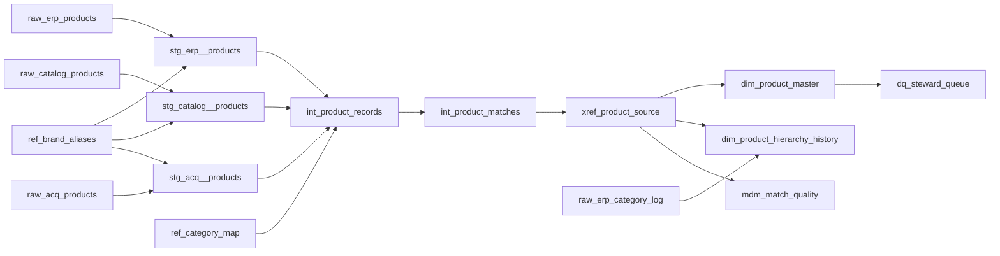

# Product MDM in dbt

A product master data pipeline for a fictional HVAC distributor that has three systems describing the same parts in three different ways. It matches the records, builds one golden record per product, keeps the category history as SCD Type 2, and scores its own matching accuracy.

Runs entirely on your laptop with dbt and DuckDB. No warehouse, no credentials.

## The problem

Anyone who's run reporting at a distributor has seen this. The ERP, the website catalog, and the item file from the company you just bought all describe the same part, and none of them agree:

| Source | Key | Description | Brand | Part number |
|---|---|---|---|---|
| ERP | 00103533 | SNSR HUMIDITY 4-20MA MERI | RIDGEWAY | RW/22535/G |
| ERP | 00103538 | SNSR HUMIDITY 4-20MA MERI | RIDGEWAY | rw 22535 g |
| Catalog | WEB-941755 | Ridgeway Air Meridian Humidity 4-20mA Sensor | Ridgeway Air | RW2-2535-G |
| Acquired | ACQ7802702 | ridgeway air meridian humidity 4-20ma sensor | Ridgeway Air Prod | RW/22535/G |

That's one real product. Two ERP material numbers, a catalog SKU with a mangled part number, and an acquired item with its own brand spelling. If you count revenue, inventory, or margin off any one of these systems, the numbers are wrong and nobody can say by how much.

The pipeline turns all four rows into one master record, `MP7A530AB640`, and keeps a crosswalk back to every source key.

## Results

| | |
|---|---|
| Source records | 4,631 (2,271 ERP, 1,768 catalog, 592 acquired) |
| Master products | 2,486 |
| Matched on part number | 4,477 |
| Matched on description | 105 |
| Left for a steward | 49 |
| **Pair precision** | **100%** (no false merges) |
| **Pair recall** | **97.7%** |
| Products flagged for review | 307 |
| Hierarchy versions | 2,650 across 2,151 products |

Precision and recall come from `mdm_match_quality`, which scores the output against a ground truth file the generator writes. The pipeline never reads that file for matching.

## Quick start

```bash
pip install -r requirements.txt
export DBT_PROFILES_DIR=.          # Windows PowerShell: $env:DBT_PROFILES_DIR="."
dbt build                          # seeds, models, contracts, and 40+ tests
dbt docs generate && dbt docs serve   # lineage graph and column docs
```

Query the results with the DuckDB CLI or any SQL client pointed at `warehouse.duckdb`:

```sql
select * from quality.mdm_match_quality;
select * from quality.dq_steward_queue limit 20;
select * from mdm.dim_product_master where needs_steward_review;
```

To regenerate the source data with a different seed or size:

```bash
python3 scripts/generate_sources.py --products 5000 --seed 11
```

## How it works



**Staging** renames each source to one shared shape, standardizes brand spellings through a steward-owned alias table, and normalizes part numbers so `AL-48213-B`, `AL48213B`, and `al 48213 b` compare equal.

**Matching** runs in two passes.

1. Exact match on brand plus normalized part number. This resolves 97% of records, including the ERP's own duplicates.
2. For records with no part number, a fuzzy match on description within the same brand and subcategory. Three guards keep it honest:
   - **Spec guard.** Every number in the description has to match. Without this, string similarity happily pairs a 2 ton 14 SEER heat pump with a 2 ton 18 SEER one. Adding the guard took precision from 99.2% to 100%.
   - **Score threshold.** Jaro-Winkler similarity of at least 0.94.
   - **Ambiguity margin.** The best candidate has to beat the runner-up by 0.02. Close calls stay unmatched.

The design choice behind all of that: a false merge is far more expensive than a false split. A split shows up as a duplicate a steward can merge in a minute. A bad merge silently blends two products' sales, costs, and inventory until someone notices the margin looks weird. So the pipeline is tuned to never guess, and everything it won't decide goes to the steward queue.

**Survivorship** picks which source wins for each attribute of the golden record:

| Attribute | Winner | Why |
|---|---|---|
| Product name | catalog > acquired > ERP | Catalog titles are written for humans |
| Part number | catalog > ERP > acquired | Catalog keeps the manufacturer's formatting |
| Category | ERP > catalog > acquired | ERP drives purchasing and finance reporting |
| Unit cost | ERP, most recent active record | System of record for cost |
| List price | catalog | It's the only one that has it |
| Active | any source | Don't hide a product someone can still sell |

**Hierarchy history** builds SCD Type 2 from the ERP category change log. It collapses re-saves and codes that map to the same place, handles a retired category structure (products that moved out of "Electrical Parts" into "Capacitors" in 2022), and closes each version the day before the next one starts. Joining sales on `sale_date between valid_from and valid_to` gives you the category a product was in when it sold, so last year's reports don't change when someone reclassifies a part today.

## Quality gates

`dbt build` fails if any of these break:

- **Contracts** on `dim_product_master` and `xref_product_source`. Column names and types are enforced, so an upstream change breaks the build here instead of breaking a dashboard three teams away.
- **Every source record lands in the crosswalk exactly once.** A record that falls out is invisible to every downstream report.
- **No master product spans two brands.** A guardrail for future changes to the matching logic.
- **SCD2 is valid.** No overlaps, no gaps, exactly one current version per product.
- **Match precision stays at or above 99.5%.**

Some checks only warn instead of failing: recall below 95%, unmapped categories, and unknown brand spellings. Those are real issues, but they shouldn't stop the nightly load. They go to the steward queue.

## Steward queue

`dq_steward_queue` turns every open issue into a prioritized work item with enough detail to act on:

| Priority | Issue | Count |
|---|---|---|
| 1 | Same part under multiple ERP material numbers | 120 |
| 2 | Fuzzy match to confirm | 105 |
| 2 | No part number and no confident match | 49 |
| 3 | Active in ERP with no usable cost | 41 |
| 4 | Active in ERP but missing from the website | 623 |

That last one isn't a data error. It's a revenue question for the e-commerce team, and the master record is what makes it answerable.

## Trade-offs worth knowing

- **Master IDs are a hash of the match key.** They're stable across reruns and need no state, but if a product's part number is corrected, it gets a new ID. In production I'd persist the ID assignment in an incremental key map so corrections keep the original ID and log the change.
- **The fuzzy pass only compares against clusters that have a part number.** Two no-MPN records for the same product won't find each other. That's rare here, and they land in the steward queue, but at scale you'd add a third pass.
- **Ground truth won't exist in production.** The same precision and recall numbers come from a sample of steward-reviewed matches, refreshed each quarter.

## Repo layout

```
scripts/generate_sources.py      synthetic messy sources + ground truth (stdlib only)
seeds/                           generated source data and steward-owned reference tables
macros/mdm_helpers.sql           MPN normalization, match text, schema naming
models/staging/                  one model per source, shared shape
models/intermediate/             unified records, two-pass matching
models/marts/                    golden record, crosswalk, SCD2 hierarchy (with contracts)
models/quality/                  match scoring, steward queue
tests/                           crosswalk coverage, SCD2 validity, brand guardrail
analyses/                        point-in-time category query
```

All data is synthetic. Brands, part numbers, and products are made up.
